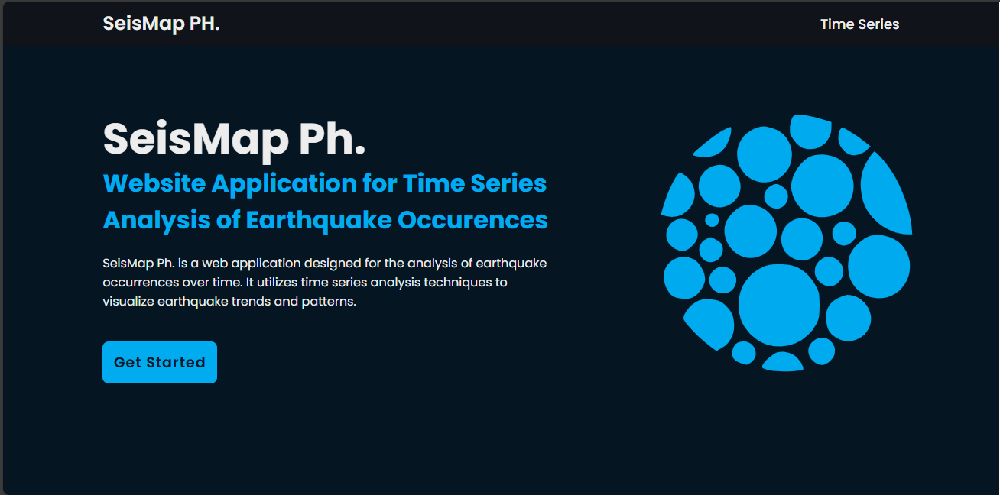
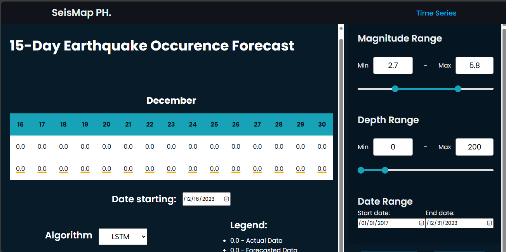

SeisMap Time Series Analysis - User Manual

Landing Page

Just click the get started button/ time series nav button/ or simply scroll to navigate the time series UI components

These range seekers are set to the specific arguments/parameters the users want to train a time series model on. If the user wishes to only include earthquake with magnitude 3 and above, he/she has the freedom to do so. The same goes to the level of depth of earthquake as well as the time range characteristics.

These are components for (1)Choosing 15 days of forecasts based on the available data in the dataset and (2)Algorithm choice of the user

